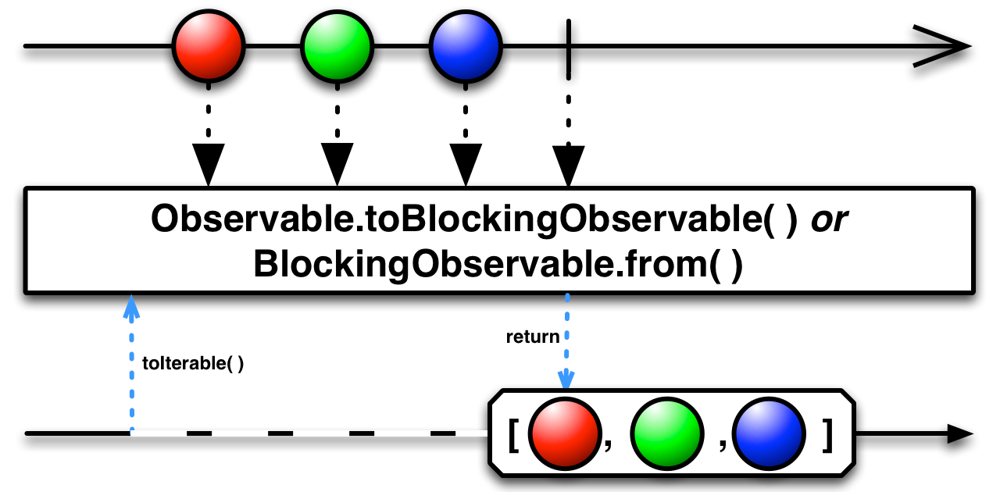
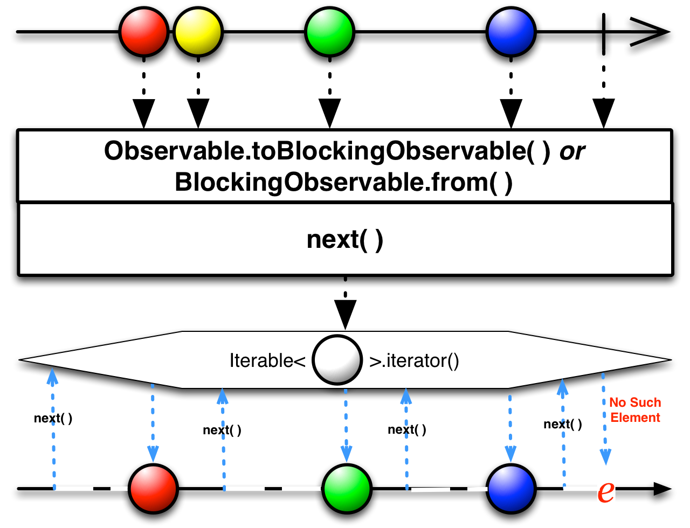
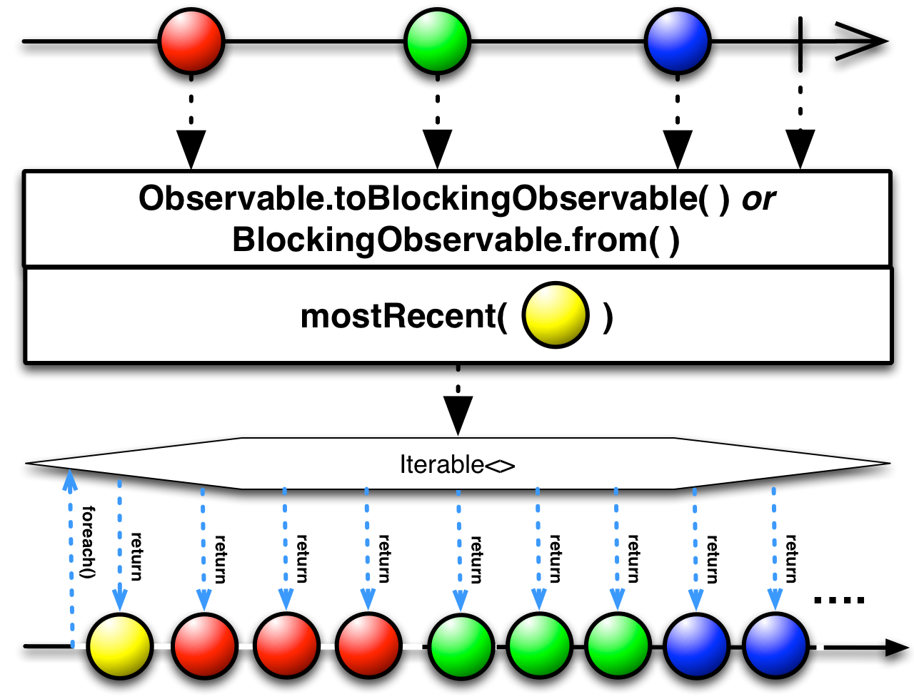

# 10. 驯服数据流之避免 monad

monad 是函数式编程中的抽象概念，是一种高度的数学抽象，关于 monad 的详细介绍请看这里： [Functors, Applicatives, And Monads In Pictures](http://adit.io/posts/2013-04-17-functors,_applicatives,_and_monads_in_pictures.html) ，不要百度搜索其他的资料， 关于 monad 的介绍，在网上有 90% 都是错误的，误导人的。

在 [www.introtorx.com](http://www.introtorx.com/) 中也有一个简短的定义：

Monad 是一种在模型域对象中封装了计算逻辑而不是数据的一种抽象数据构造类型。

> Monads are a kind of abstract data type constructor that encapsulate program logic instead of data in the domain model.
> Observable 就是一个 monad。Rx 代码定义了需要完成的任务，但是实际执行任务的过程确在 Rx 执行代码之外执行。本节中的 monad 我们只是指代 Observable。

### 为什么要避免 monad

主要有两个原因：第一个原因是 Rx 新手还是习惯传统的编码方式。使用另外一种方式（paradigm ）来计算部分结果或许可以让你获取到正确的结果，但是你依然在尝试搞明白 Rx 是如何工作的。第二个原因是 我们使用的第三方库和组件并没有按照 Rx 的方法来设计。当重构现有的代码使用 Rx， 让 Rx 继续使用阻塞的方式工作也许是最好的选择。

### BlockingObservable

使用 BlockingObservable 可以把 Observable 中的数据通过阻塞的方式发射出来。任何一个 Observable 都可以使用下面两种方式来转换为阻塞的 Observable。

```java
public final BlockingObservable<T> toBlocking()
```

```java
public static <T> BlockingObservable<T> from(Observable<? extends T> o)
```

BlockingObservable 并没有继承 Observable，所以无法使用常用的操作函数。他自己实现了一部分功能，可以通过阻塞的方式来从中获取数据。里面有很多我们已经见到过的函数的阻塞实现。

### forEach

Observable 有个函数叫做 forEach。 forEach 为 subscribe 的一个没有返回Subscription 的别名。
例如下面的例子：

```java
Observable<Long> values = Observable.interval(100, TimeUnit.MILLISECONDS);

values
    .take(5)
    .forEach(v -> System.out.println(v));
System.out.println("Subscribed");
```

结果：

```
Subscribed
0
1
2
3
4
```

通过 forEach 可以处理 Observable 每个发射出来的数据。由于是非阻塞执行的，所以结果先答应出来 Subscribed，然后是每个发射的数字。

BlockingObservable 没有 subscribe 函数，但是有这个 forEach 函数。

```java
Observable<Long> values = Observable.interval(100, TimeUnit.MILLISECONDS);

values
    .take(5)
    .toBlocking()
    .forEach(v -> System.out.println(v));
System.out.println("Subscribed");
```

结果：

```
0
1
2
3
4
Subscribed
```

这里由于使用的是阻塞的 Observable，所以当 forEach 执行完后，才会执行后面的打印 Subscribed 的代码。同时阻塞的 Observable 也没有 onError 和 onCompleted 函数。当执行完成的时候，就执行完了；当错误发生的时候，异常就直接就地抛出了；

```java
Observable<Long> values = Observable.error(new Exception("Oops"));

try {
    values
        .take(5)
        .toBlocking()
        .forEach(v -> System.out.println(v));
}
catch (Exception e) {
    System.out.println("Caught: " + e.getMessage());
}
System.out.println("Subscribed");
```

结果：

```
Caught: java.lang.Exception: Oops
Subscribed
```

### first, last, single

BlockingObservable 还有这3个函数，以及带有默认值的另外三个函数：firstOrDefault, lastOrDefault 和 singleOrDefault.

这些函数会阻塞当前的线程直到有数据发射出来并返回符合结果的数据：

```java
Observable<Long> values = Observable.interval(100, TimeUnit.MILLISECONDS);

long value = values
    .take(5)
    .toBlocking()
    .first(i -> i>2);
System.out.println(value);
```

结果：

```
3
```

first 会一直阻塞，直到有数据发射并返回符合条件的数据。
和 forEach 一样，错误发生了也是就地抛出:

```java
Observable<Long> values = Observable.interval(100, TimeUnit.MILLISECONDS);

try {
    long value = values
        .take(5)
        .toBlocking()
        .single(i -> i>2);
    System.out.println(value);
}
catch (Exception e) {
    System.out.println("Caught: " + e);
}
```

结果：

```
Caught: java.lang.IllegalArgumentException: Sequence contains too many elements
```

### To Iterable

还可以使用 BlockingObservable 上的一些方法把 Observable 转换为 iterables ，然后可以传统的 Java 方式来遍历这些集合。当需要处理数据的时候，就调用 Iterator 的 next() 函数，如果有数据 next() 就直接返回；如果没有数据 next() 函数就阻塞直到有数据产生。

有多种方式把 BlockingObservable 转换为 Iterable ，每种方式都有不同的区别。

### toIterable

```java
public java.lang.Iterable<T> toIterable()
```



这种实现方式，把 Observable 所发射的所有数据给收集起来并缓存到一个集合中。由于缓存的存在，所以不会丢失数据。一单有下一个数据 next() 函数就返回。否则的话就阻塞到数据可用。注意 上图画的有点问题，看起来好像等 Observable 发射完后来返回集合。

```java
Observable<Long> values = Observable.interval(500, TimeUnit.MILLISECONDS);

Iterable<Long> iterable = values.take(5).toBlocking().toIterable();
for (long l : iterable) {
    System.out.println(l);
}
```

结果：

```
0
1
2
3
4
```

注意： iterable 的 hasNext() 或者 next() 函数都会阻塞直到有数据可用。如果 Observable 完成了， hasNext 返回 false， next 抛出异常：java.util.NoSuchElementException。

### next

```java
public java.lang.Iterable<T> next()
```



这种实现数据没有缓存。 iterator 总是等待下一个数据并立刻返回。

```java
Observable<Long> values = Observable.interval(500, TimeUnit.MILLISECONDS);

values.take(5)
    .subscribe(v -> System.out.println("Emitted: " + v));

Iterable<Long> iterable = values.take(5).toBlocking().next();
for (long l : iterable) {
    System.out.println(l);
    Thread.sleep(750);
}
```

结果：

```
Emitted: 0
0
Emitted: 1
Emitted: 2
2
Emitted: 3
Emitted: 4

```

这里的示例中， 打印语句（消费者）处理的速度比数据发射的速度慢。所以消费者会错过一些数据。

### latest

```java
public java.lang.Iterable<T> latest()1
```

latest 和 next 类似，区别就是 latest 会缓存一个数据。

```java
Observable<Long> values = Observable.interval(500, TimeUnit.MILLISECONDS);

values.take(5)
    .subscribe(v -> System.out.println("Emitted: " + v));

Iterable<Long> iterable = values.take(5).toBlocking().latest();
for (long l : iterable) {
    System.out.println(l);
    Thread.sleep(750);
}
```

结果：

```
Emitted: 0
0
Emitted: 1
1
Emitted: 2
Emitted: 3
3
Emitted: 4
```

使用 latest 的时候，如果在下一个数据发射之前，当前的数据还没有被消费者消费，则当前的值就会丢失。如果 消费者比 生产者（Observable）发射的数据快，则 iterator 会阻塞并且等待下一个数据。

上面示例中的最后一个数据 4 并没有被消费掉。由于 onCompleted 是立刻结束的，导致下一次消费者通过 next 获取数据的时候，看到的是一个已经结束的 Observable，而 iterator.hasNext() 如果发现是一个已经结束的 Observable 则返回 false，尽管还有一个数据还没有被消费。

### mostRecent

```java
public java.lang.Iterable<T> mostRecent(T initialValue)
```



mostRecent 返回的 iterator 从来不会阻塞。他会缓存最近一个值，如果消费者比 生产者处理的速度慢，则有数据会丢失。和 latest 不一样的是， 只要消费者需要数据，则缓存的数据就会直接返回。这样，如果消费者处理数据的速度快，则消费者就会看到重复的数据。所以为了实现不阻塞的操作，该函数需要一个初始化的值。如果 Observable 还没有发射数据，消费者这个时候看到的就是这个初始化的值。

```java
Observable<Long> values = Observable.interval(500, TimeUnit.MILLISECONDS);

values.take(5)
    .subscribe(v -> System.out.println("Emitted: " + v));

Iterable<Long> iterable = values.take(5).toBlocking().mostRecent(-1L);
for (long l : iterable) {
    System.out.println(l);
    Thread.sleep(400);
}
```

结果：

```
-1
-1
Emitted: 0
0
Emitted: 1
1
Emitted: 2
2
Emitted: 3
3
3
Emitted: 4
```

### Future

使用 toFuture 函数也可以把 BlockingObservable 转换为一个 Future，该方法只是创建一个 Future 并返回，不会阻塞。Future 可以让消费者决定如何处理异步操作。Future 也可以处理异常情况。

```java
Observable<Long> values = Observable.timer(500, TimeUnit.MILLISECONDS);

values.subscribe(v -> System.out.println("Emitted: " + v));

Future<Long> future = values.toBlocking().toFuture();
System.out.println(future.get());
```

结果：

```
Emitted: 0
0
```

通过这种方式创建的 Future，要求 Observable 只发射一个数据，和 single 函数要求的一样。如果发射了多个数据，则 Future 会抛出 java.lang.IllegalArgumentException.

### Locks

#### Deadlocks

到目前为止我们都选择忽略可能导致死锁的情况。 Rx 的非阻塞特性导致很难创建非必要的死锁。然后本节中我们把 Observable 转换为 阻塞的操作，这样又导致死锁很容易出现了。
例如：

```java
ReplaySubject<Integer> subject = ReplaySubject.create();

subject.toBlocking().forEach(v -> System.out.println(v));
subject.onNext(1);
subject.onNext(2);
subject.onCompleted();
```

forEach 只有当 Observable 结束发射的时候才返回。而后面的 onNext 和 onCompleted 需要 forEach 返回后才能执行，这样就导致了死锁。所以 forEach 会一直等待下去。

### 没有结束的Observable

有些阻塞操作（比如 last() ）需要 Observable 结束发射数据才能返回。而 有些操作（比如 first() ）需要 Observable 需要至少发射一个数据才能返回。所以在 BlockingObservable 上使用这些函数需要注意 ，如果 Observable 不满足条件则可能会导致该操作永远阻塞。所以为了避免永远阻塞的问题，可以指定一个超时时间间隔， 在后面的 Timeshifter 数据流部分会介绍如何做。
