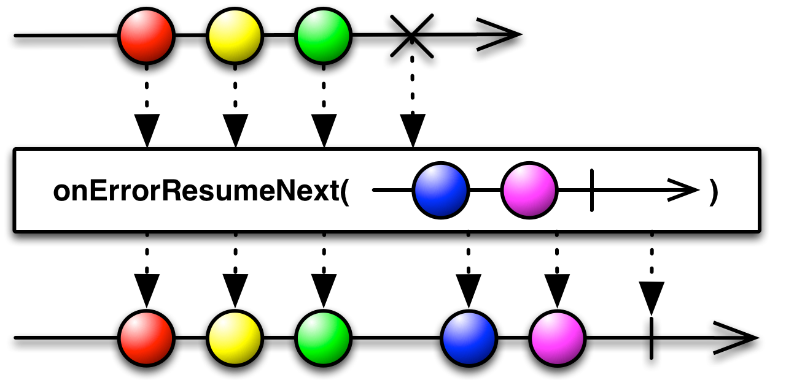

# 11. 驯服数据流之高级错误处理

在实际项目代码中可能出现各种各样的异常情况，并不是每一个异常都需要告诉上层代码的。在传统的 Java 中，你可以捕获一个异常，然后决定是自己处理该异常还是再次抛出去。同样，在 RxJava 中，你也可以根据异常来执行不同的逻辑而无需结束 Observable，也不再强迫 Observer 处理所有情况。

## Resume

### onErrorReturn

onErrorReturn 操作函数的功能是：当发生错误的时候，发射一个默认值然后结束数据流。所以 Subscriber 看不到异常信息，看到的是正常的数据流结束状态。


```java
Observable<String> values = Observable.create(o -> {
    o.onNext("Rx");
    o.onNext("is");
    o.onError(new Exception("adjective unknown"));
});

values
    .onErrorReturn(e -> "Error: " + e.getMessage())
    .subscribe(v -> System.out.println(v));123456789
```

结果：

```
Rx
is
Error: adjective unknown123
```

### onErrorResumeNext

onErrorResumeNext 的功能是：当错误发生的时候，使用另外一个数据流继续发射数据。在返回的 Observable 中是看不到错误信息的。

```java
public final Observable<T> onErrorResumeNext(
    Observable<? extends T> resumeSequence)
public final Observable<T> onErrorResumeNext(
    Func1<java.lang.Throwable,? extends Observable<? extends T>> resumeFunction)1234
```



第二个重载的函数可以根据错误的信息来返回不同的 Observable。

```java
Observable<Integer> values = Observable.create(o -> {
    o.onNext(1);
    o.onNext(2);
    o.onError(new Exception("Oops"));
});

values
    .onErrorResumeNext(Observable.just(Integer.MAX_VALUE))
    .subscribe(new PrintSubscriber("with onError: "));123456789
```

结果：

```
with onError: : 1
with onError: : 2
with onError: : 2147483647
with onError: : Completed1234
```

利用这个操作函数可以实现把一个异常信息包装起来再次抛出。在传统的 Java 中，如果异常发生的时候发现当前无法处理该异常，则会再次抛出该异常。通常情况下都会包装（Wrap）一下异常信息再抛出。在 Rx 中也可以这样用：

```java
.onErrorResumeNext(e -> Observable.error(new UnsupportedOperationException(e)))1
```

### onExceptionResumeNext

onExceptionResumeNext 和 onErrorResumeNext 的区别是只捕获 Exception；

```java
Observable<String> values = Observable.create(o -> {
    o.onNext("Rx");
    o.onNext("is");
    //o.onError(new Throwable() {}); // 这个为 error 不会捕获
    o.onError(new Exception()); // 这个为 Exception 会被捕获
});

values
    .onExceptionResumeNext(Observable.just("hard"))
    .subscribe(v -> System.out.println(v));12345678910
```

Retry

如果发生了不定性的异常，则通常会重试一下看看是否正常了。 retry 的功能就算重新订阅到事件流，并重头重新开始发射数据。

```java
public final Observable<T> retry()
public final Observable<T> retry(long count)12
```


没有参数的 retry() 函数会一直重试，直到没有异常发生为止。而带有参数的 retry(n) 函数会重试 N 次， 如果 N 次后还是失败，则不再重试了，数据流发射一个异常信息并结束。

```java
Random random = new Random();
Observable<Integer> values = Observable.create(o -> {
    o.onNext(random.nextInt() % 20);
    o.onNext(random.nextInt() % 20);
    o.onError(new Exception());
});

values
    .retry(1)
    .subscribe(v -> System.out.println(v));12345678910
```

结果：

```
java.lang.Exception1
```

上面的示例，发射了两个数字遇到异常信息，然后重试一次，又发射 两个数据遇到异常信息，然后抛出该异常并结束。

**请注意：上面的示例中两次发射的数字不一样。说明 retry 并不像 replay 一样会缓存之前的数据。一般情况下，这样的情况都是不合理的。所以一般情况下，只有具有副作用的时候或者 Observable 是 hot 的时候 才应该使用 retry。**

### retryWhen

retryWhen 更具有控制力。

```java
public final Observable<T> retryWhen(
    Func1<? super Observable<? extends java.lang.Throwable>,? extends Observable<?>> notificationHandler)12
```

retryWhen 的参数是一个函数， 该函数的输入参数为一个异常 Observable，返回值为另外一个 Observable。 输入参数中包含了 retryWhen 发生时候遇到的异常信息；返回的 Observable 为一个信号，用来判别何时需要重试的：

- 如果返回的 Observable 发射了一个数据，retryWhen 将会执行重试操作
- 如果返回的 Observable 发射了一个错误信息，retryWhen 将会发射一个错误并不会重试
- 如果返回的 Observable 正常结束了，retryWhen 也正常结束。

参数返回的 Observable 发射的数据类型是无关紧要的。该 Observable 的数据只是用来当做是否重试的信号。数据本身是无用的。
下面一个示例，构造一个等待 100 毫秒再重试的机制：

```java
Observable<Integer> source = Observable.create(o -> {
    o.onNext(1);
    o.onNext(2);
    o.onError(new Exception("Failed"));
});

source.retryWhen((o) -> o
        .take(2)
        .delay(100, TimeUnit.MILLISECONDS))
    .timeInterval()
    .subscribe(
        System.out::println,
        System.out::println);12345678910111213
```

结果：

```
TimeInterval [intervalInMilliseconds=21, value=1]
TimeInterval [intervalInMilliseconds=0, value=2]
TimeInterval [intervalInMilliseconds=104, value=1]
TimeInterval [intervalInMilliseconds=0, value=2]
TimeInterval [intervalInMilliseconds=103, value=1]
TimeInterval [intervalInMilliseconds=0, value=2]123456
```

源 Observable 发射两个数字 然后遇到异常；当异常发生的时候，retryWhen 返回的 判断条件 Observable 会获取到这个异常，这里等待 100毫秒然后把这个异常当做数据发射出去告诉 retryWhen 开始重试。take(2) 参数确保判断条件 Observable 只发射两个数据（源 Observable 出错两次）然后结束。所以当源 Observable 出现两次错误以后就不再重试了。

### using

using 操作函数是用来管理资源的，如果一个 Observable 需要使用一个资源来发射数据（比如 需要使用一个文件资源，从文件中读取内容），当该 Observable 结束的时候（不管是正常结束还是异常结束）就释放该资源。这样你就不用自己管理资源了， 用 Rx 的方式来管理资源。

```java
public static final <T,Resource> Observable<T> using(
    Func0<Resource> resourceFactory,
    Func1<? super Resource,? extends Observable<? extends T>> observableFactory,
    Action1<? super Resource> disposeAction)1234
```

using 有三个参数。当 Observable 被订阅的时候，resourceFactory 用来获取到需要的资源；observableFactory 用这个资源来发射数据；当 Observable 完成的时候，disposeAction 来释放资源。

下面的示例中，假设 String 是一个需要管理的资源。

```java
Observable<Character> values = Observable.using(
    () -> {
        String resource = "MyResource";
        System.out.println("Leased: " + resource);
        return resource;
    },
    (resource) -> {
        return Observable.create(o -> {
            for (Character c : resource.toCharArray())
                o.onNext(c);
            o.onCompleted();
        });
    },
    (resource) -> System.out.println("Disposed: " + resource));

values
    .subscribe(
        v -> System.out.println(v),
        e -> System.out.println(e));12345678910111213141516171819
```

结果：

```
Leased: MyResource
M
y
R
e
s
o
u
r
c
e
Disposed: MyResource123456789101112
```

当订阅到 values 的时候， 调用 resourceFactory 函数返回一个字符串 “MyResource”；observableFactory 使用返回的 “MyResource” 字符串来生成一个 Observable， 该 Observable 发射”MyResource” 字符串中的每个字符；当发生完成的时候， disposeAction 来释放这个字符串资源。

有一点需要注意： 和使用 create 创建 Observable 一样，我们需要自己来结束 Observable 的发射（onCompleted 的调用）。如果你没有结束 Observable，则资源是永远不会释放的。
