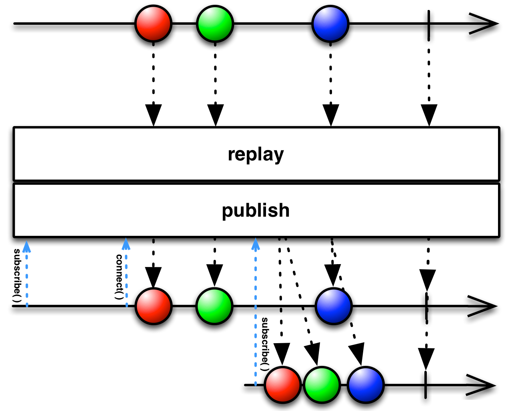
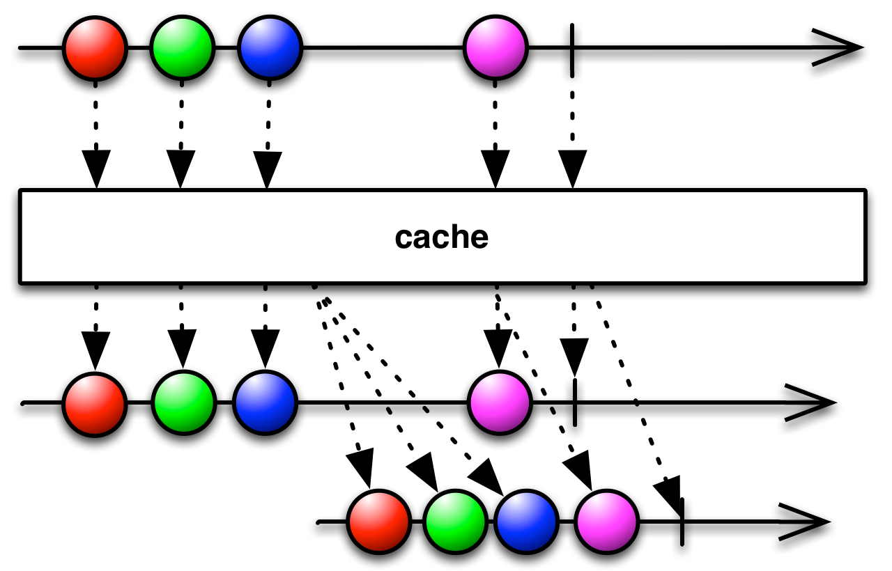

# 15. 驯服数据流之 hot & cold Observable

Observable 数据流有两种类型：hot 和 cold。这两种类型有很大的不同。本节介绍他们的区别，以及作为 Rx 开发者应该如何正确的使用他们。

## Cold observables

只有当有订阅者订阅的时候， Cold Observable 才开始执行发射数据流的代码。并且每个订阅者订阅的时候都独立的执行一遍数据流代码。 Observable.interval 就是一个 Cold Observable。每一个订阅者都会独立的收到他们的数据流。

```java
Observable<Long> cold = Observable.interval(200, TimeUnit.MILLISECONDS);

cold.subscribe(i -> System.out.println("First: " + i));
Thread.sleep(500);
cold.subscribe(i -> System.out.println("Second: " + i));

```

结果：

```
First: 0
First: 1
First: 2
Second: 0
First: 3
Second: 1
First: 4
Second: 2
...
```

虽然这两个 Subscriber 订阅到同一个Observable 上，只是订阅的时间不同，他们都收到同样的数据流，但是同一时刻收到的数据是不同的。

在本教程中之前所见到的 Observable 都是 Cold Observable。 Observable.create 创建的也是 Cold Observable，而 just, range, timer 和 from 这些创建的同样是 Cold Observable。

## Hot observables

Hot observable 不管有没有订阅者订阅，他们创建后就开发发射数据流。 一个比较好的示例就是 鼠标事件。 不管系统有没有订阅者监听鼠标事件，鼠标事件一直在发生，当有订阅者订阅后，从订阅后的事件开始发送给这个订阅者，之前的事件这个订阅者是接受不到的；如果订阅者取消订阅了，鼠标事件依然继续发射。

## Publish

Cold Observable 和 Hot Observable 之间可以相互转化。使用 publish 操作函数可以把 Cold Observable 转化为 Hot Observable。

```java
public final ConnectableObservable<T> publish()
```


publish 返回一个 ConnectableObservable 对象，这个对象是 Observable 的之类，多了三个函数：

```java
public final Subscription connect()
public abstract void connect(Action1<? super Subscription> connection)
public Observable<T> refCount()
```

另外还有一个重载函数，可以在发射数据之前对数据做些处理：

```java
public final <R> Observable<R> publish(Func1<? super Observable<T>,? extends Observable<R>> selector)
```

之前介绍的所有对 Observable 的操作都可以在 selector 中使用。你可以通过 selector 参数创建一个 Subscription ，后来的订阅者都订阅到这一个 Subscription 上，这样可以确保所有的订阅者都在同一时刻收到同样的数据。

这个重载函数返回的是 Observable 而不是 ConnectableObservable， 所以下面讨论的操作函数无法在这个重载函数返回值上使用。

## connect

ConnectableObservable 如果不调用 connect 函数则不会触发数据流的执行。当调用 connect 函数以后，会创建一个新的 subscription 并订阅到源 Observable （调用 publish 的那个 Observable）。这个 subscription 开始接收数据并把它接收到的数据转发给所有的订阅者。这样，所有的订阅者在同一时刻都可以收到同样的数据。

```java
ConnectableObservable<Long> cold = Observable.interval(200, TimeUnit.MILLISECONDS).publish();
cold.connect();

cold.subscribe(i -> System.out.println("First: " + i));
Thread.sleep(500);
cold.subscribe(i -> System.out.println("Second: " + i));    
```

结果：

```
First: 0
First: 1
First: 2
Second: 2
First: 3
Second: 3
First: 4
Second: 4
First: 5
Second: 5
```

## Disconnecting

connect 函数返回的是一个 Subscription，和 Observable.subscribe返回的结果一样。 可以使用这个 Subscription 来取消订阅到 ConnectableObservable。 如果调用 这个 Subscription 的 unsubscribe 函数，可以停止把数据转发给 Observer，但是这些 Observer 并没有从 ConnectableObservable 上取消注册，只是停止接收数据了。如果再次调用 connect ， 则 ConnectableObservable 开始一个新的订阅，在 ConnectableObservable 上订阅的 Observer 会再次开始接收数据。

```java
ConnectableObservable<Long> connectable = Observable.interval(200, TimeUnit.MILLISECONDS).publish();
Subscription s = connectable.connect();

connectable.subscribe(i -> System.out.println(i));

Thread.sleep(1000);
System.out.println("Closing connection");
s.unsubscribe();

Thread.sleep(1000);
System.out.println("Reconnecting");
s = connectable.connect();
```

结果：

```
0
1
2
3
4
Closing connection
Reconnecting
0
1
2
...
```

通过调用 connect 来重新开始订阅，会创建一个新的订阅。如果源 Observable 为 Cold Observable 则数据流会重新执行一遍。

如果你不想结束数据流，只想从 publish 返回的 Hot Observable 上取消注册，则可以使用 subscribe 函数返回的 Subscription 对象。

```java
ConnectableObservable<Long> connectable = Observable.interval(200, TimeUnit.MILLISECONDS).publish();
Subscription s = connectable.connect();

Subscription s1 = connectable.subscribe(i -> System.out.println("First: " + i));
Thread.sleep(500);
Subscription s2 = connectable.subscribe(i -> System.out.println("Second: " + i));

Thread.sleep(500);
System.out.println("Unsubscribing second");
s2.unsubscribe();
```

结果：

```
First: 0
First: 1
First: 2
Second: 2
First: 3
Second: 3
First: 4
Second: 4
Unsubscribing second
First: 5
First: 6
```

## refCount

ConnectableObservable.refCount 返回一个特殊的 Observable， 这个 Observable 只要有订阅者就会继续发射数据。

```java
Observable<Long> cold = Observable.interval(200, TimeUnit.MILLISECONDS).publish().refCount();

Subscription s1 = cold.subscribe(i -> System.out.println("First: " + i));
Thread.sleep(500);
Subscription s2 = cold.subscribe(i -> System.out.println("Second: " + i));
Thread.sleep(500);
System.out.println("Unsubscribe second");
s2.unsubscribe();
Thread.sleep(500);
System.out.println("Unsubscribe first");
s1.unsubscribe();

System.out.println("First connection again");
Thread.sleep(500);
s1 = cold.subscribe(i -> System.out.println("First: " + i));
```

结果：

```
First: 0
First: 1
First: 2
Second: 2
First: 3
Second: 3
Unsubscribe second
First: 4
First: 5
First: 6
Unsubscribe first
First connection again
First: 0
First: 1
First: 2
First: 3
First: 4
```

如果没有订阅者订阅到 refCount 返回的 Observable，则不会执行数据流的代码。如果所有的订阅者都取消订阅了，则数据流停止。重新订阅再回重新开始数据流。

## replay

```java
public final ConnectableObservable<T> replay()
```



replay 和 ReplaySubject 类似。当和源 Observable 链接后，开始收集数据。当有 Observer 订阅的时候，就把收集到的数据线发给 Observer。然后和其他 Observer 同时接受数据。

```java
ConnectableObservable<Long> cold = Observable.interval(200, TimeUnit.MILLISECONDS).replay();
Subscription s = cold.connect();

System.out.println("Subscribe first");
Subscription s1 = cold.subscribe(i -> System.out.println("First: " + i));
Thread.sleep(700);
System.out.println("Subscribe second");
Subscription s2 = cold.subscribe(i -> System.out.println("Second: " + i));
Thread.sleep(500);
```

结果：

```
Subscribe first
First: 0
First: 1
First: 2
Subscribe second
Second: 0
Second: 1
Second: 2
First: 3
Second: 3
```

replay 和 publish 一样也返回一个 ConnectableObservable 。所以我们可以在上面使用 refCount 来创建新的 Observable 也可以取消注册。

replay 有 8个重载函数：

```java
ConnectableObservable<T> replay()
<R> Observable<R> replay(Func1<? super Observable<T>,? extends Observable<R>> selector)
<R> Observable<R> replay(Func1<? super Observable<T>,? extends Observable<R>> selector, int bufferSize)
<R> Observable<R> replay(Func1<? super Observable<T>,? extends Observable<R>> selector, int bufferSize, long time, java.util.concurrent.TimeUnit unit)
<R> Observable<R> replay(Func1<? super Observable<T>,? extends Observable<R>> selector, long time, java.util.concurrent.TimeUnit unit)
ConnectableObservable<T> replay(int bufferSize)
ConnectableObservable<T> replay(int bufferSize, long time, java.util.concurrent.TimeUnit unit)
ConnectableObservable<T> replay(long time, java.util.concurrent.TimeUnit unit)
```

有三个参数 bufferSize、 selector 和 time （以及指定时间单位的 unit）

- bufferSize 用来指定缓存的最大数量。当新的 Observer 订阅的时候，最多只能收到 bufferSize 个之前缓存的数据。
- time, unit 用来指定一个数据存货的时间，新订阅的 Observer 只能收到时间不超过这个参数的数据。
- selector 和 publish(selector) 用来转换重复的 Observable。

下面是一个 bufferSize 的示例：

```java
ConnectableObservable<Long> source = Observable.interval(1000, TimeUnit.MILLISECONDS)
    .take(5)
    .replay(2);

source.connect();
Thread.sleep(4500);
source.subscribe(System.out::println);
```

结果：

```
2
3
4
```

## cache

cache 操作函数和 replay 类似，但是隐藏了 ConnectableObservable ，并且不用管理 subscription 了。当第一个 Observer 订阅的时候，内部的 ConnectableObservable 订阅到源 Observable。后来的订阅者会收到之前缓存的数据，但是并不会重新订阅到源 Observable 上。

```java
public final Observable<T> cache()
public final Observable<T> cache(int capacity)
```



```java
Observable<Long> obs = Observable.interval(100, TimeUnit.MILLISECONDS)
    .take(5)
    .cache();

Thread.sleep(500);
obs.subscribe(i -> System.out.println("First: " + i));
Thread.sleep(300);
obs.subscribe(i -> System.out.println("Second: " + i));
```

结果：

```
First: 0
First: 1
First: 2
Second: 0
Second: 1
Second: 2
First: 3
Second: 3
First: 4
Second: 4
```

从上面示例中可以看到，只有当有订阅者订阅的时候，源 Observable 才开始执行。当第二个订阅者订阅的时候，会收到之前缓存的数据。

需要注意的是，如果所有的订阅者都取消订阅了 内部的 ConnectableObservable 不会取消订阅，这点和 refCount 不一样。只要第一个订阅者订阅了，内部的 ConnectableObservable 就链接到源 Observable上了并且不会取消订阅了。 这点非常重要，因为当我们一单订阅了，就没法取消源 Observable了， 直到源 Observable 结束或者程序内存溢出。 可以指定缓存个数的重载函数也没法解决这个问题，缓存限制只是作为一个优化的提示，并不会限制内部的缓存大小。

```java
Observable<Long> obs = Observable.interval(100, TimeUnit.MILLISECONDS)
    .take(5)
    .doOnNext(System.out::println)
    .cache()
    .doOnSubscribe(() -> System.out.println("Subscribed"))
    .doOnUnsubscribe(() -> System.out.println("Unsubscribed"));

Subscription subscription = obs.subscribe();
Thread.sleep(150);
subscription.unsubscribe();
```

结果：

```
Subscribed
0
Unsubscribed
1
2
3
4
```

上面的示例中，doOnNext 打印源 Observable 发射的每个数据。而 doOnSubscribe 和doOnUnsubscribe 打印缓存后的 Observable 的订阅和取消订阅事件。可以看到当订阅者订阅的时候，数据流开始发射，取消订阅数据流并不会停止。

## Multicast

share 函数是 Observable.publish().refCount() 的别名。可以让你的订阅者分享一个 subscription，只要还有订阅者在，这个 subscription 就继续工作。
