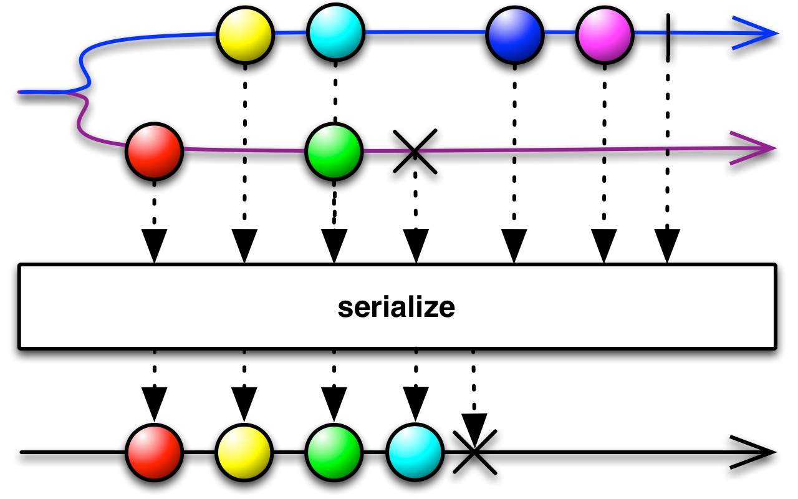

## 16. 驯服数据流之自定义操作函数

RxJava 提供了很多[操作函数](http://reactivex.io/RxJava/javadoc/rx/Observable.html)。加上各种重载函数，一共有 300 多个操作函数。这些函数中只有很少一部分是核心的操作函数，离开这些核心的函数根本就没法使用 RxJava 了。其他的大部分函数只是一些便捷函数，方便开发者使用，并且他们的名字基本都说明了他们的用法。比如 如果操作函数 source.First(user -> user.isOnline()) 不存在，则我们依然可以使用 source.filter(user -> user.isOnline()).First() 来实现同样的功能。

尽管提供了 300 多个操作函数，但这些也都是很基本的操作。 Rx 提供了基础的功能，在此之上可以建构更加复杂的功能。最终你会遇到定义可重用代码的地方。 在 标准 Java 中重用代码是通过类和函数来实现，而在 Rx 中，是通过自定义操作函数来实现代码重用。例如，在您的程序中，计算数字流的平均数可能经常使用。但是 Observable 中并没有该函数，你可以自定义一个：

```java
class AverageAcc {
    public final int sum;
    public final int count;
    public AverageAcc(int sum, int count) {
        this.sum = sum;
        this.count = count;
    }
}
```

```java
source
    .scan(
        new AverageAcc(0,0),
        (acc, v) -> new AverageAcc(acc.sum + v, acc.count + 1))
    .filter(acc -> acc.count > 0)
    .map(acc -> acc.sum/(double)acc.count);
```

上面的代码实现了功能，但是没法重用。在标准的 Java 中可能会定义一个可以处理各种数据的函数，所以 一般的 Java 开发者可能一开始想到用一个函数来实现：

```java
public static Observable<Double> runningAverage(Observable<Integer> source) {
    return source
        .scan(
            new AverageAcc(0,0),
            (acc, v) -> new AverageAcc(acc.sum + v, acc.count + 1))
        .filter(acc -> acc.count > 0)
        .map(acc -> acc.sum/(double)acc.count);
}
```

然后就可以重用了：

```java
runningAverage(Observable.just(3, 5, 6, 4, 4))
    .subscribe(System.out::println);
```

结果：

```
3.0
4.0
4.666666666666667
4.5
4.4
```

由于上面的代码很简单，所以看起来还不错。如果我们用自定义的操作函数做一些复杂的操作。例如，源 Observable 为一个句子，把这个句子分割每个单词，并且把每个单词的长度作为数字的输入：

```java
runningAverage(
    Observable.just("The brown fox jumped and I forget the rest")
        .flatMap(phrase -> Observable.from(phrase.split(" ")))
        .map(word -> word.length()))
    .subscribe(System.out::println);
```

上面的代码可以正常使用，但是看起来不是纯 Rx 实现。如果每个 Rx 中的函数都是这样实现的，则最终多个操作函数一起使用就变成这样了：

```java
subscribe(
    lastOperator(
        middleOperator(
            firstOperator(source))))
```

这样我们在倒着处理数据流！ (^o^)/~

### 把操作函数串联起来

Rx 中操作函数是通过串联调用的方式来使用的，而不是嵌套调用。这种用法在 Java 中也很常见，每个函数都返回该对象本身，这样就可以一直调用多个函数。例如 strings 对象：

```java
String s = new String("Hi").toLowerCase().replace('a', 'c');
```

通过这种方式，可以直观的看到对数据修改的顺序，如果用了多个操作函数看起来也更加简洁。

理想情况应该让你的自定义操作函数和标准的操作函数一样，可以串联的调用。

```java
Observable.range(0,10)
    .map(i -> i*2)
    .myOperator()
    .subscribe();
```

很多语言都直接支持该特性。但是 Java 并不直接支持。你不得不修改 Observable 的代码来添加你的操作函数。但是你没法告诉 RxJava 开发团队，让他们把你专用的操作函数给添加到 RxJava 标准类库中。虽然可以通过继承 Observable 的方式来添加你的操作函数，但是这样做也没法和标准的操作函数组合使用了。

### compose

RxJava 提供了 compose 函数可以解决该问题。

```java
public <R> Observable<R> compose(Observable.Transformer<? super T,? extends R> transformer)
```

一个 Transformer 接口。Transformer< T,R> 接口其实只是 Func1< Observable,Observable> 接口的另外一种简化形式。这是一个函数，把参数 Observable 转换为 Observable， 和我们计算平均数的实现是一样的：

```java
Observable.just(3, 5, 6, 4, 4)
    .compose(Main::runningAverage)
    .subscribe(System.out::println);
```

在 Java 中没法直接引用函数的名字，上面示例中，我们假设自定义的操作函数在 Main 类中定义。这样自定义的操作函数就融合到串联调用中了，只不过需要先调用 compose 函数。通过在新的类中实现 Observable.Transformer 接口可以实现更好的封装：

```java
public class RunningAverage implements Observable.Transformer<Integer, Double> {
    private static class AverageAcc {
        public final int sum;
        public final int count;
        public AverageAcc(int sum, int count) {
            this.sum = sum;
            this.count = count;
        }
    }

    @Override
    public Observable<Double> call(Observable<Integer> source) {
        return source
            .scan(
                new AverageAcc(0,0),
                (acc, v) -> new AverageAcc(acc.sum + v, acc.count + 1))
            .filter(acc -> acc.count > 0)
            .map(acc -> acc.sum/(double)acc.count);
    }
}
```

然后可以这样使用：

```java
source.compose(new RunningAverage())
```

大部分的 Rx 操作函数都是有参数的，我们也可以支持参数。比如：

```java
public class RunningAverage implements Observable.Transformer<Integer, Double> {
    private static class AverageAcc {
        public final int sum;
        public final int count;
        public AverageAcc(int sum, int count) {
            this.sum = sum;
            this.count = count;
        }
    }

    final int threshold;

    public RunningAverage() {
        this.threshold = Integer.MAX_VALUE;
    }

    public RunningAverage(int threshold) {
        this.threshold = threshold;
    }

    @Override
    public Observable<Double> call(Observable<Integer> source) {
        return source
            .filter(i -> i< this.threshold)
            .scan(
                new AverageAcc(0,0),
                (acc, v) -> new AverageAcc(acc.sum + v, acc.count + 1))
            .filter(acc -> acc.count > 0)
            .map(acc -> acc.sum/(double)acc.count);
    }
}
```

这样我们就可以调用 source.compose(new RunningAverage(5)) 了。由于 Java 语言的限制，我们没法进一步优化这个使用情况了。这里有一个更加复杂的自定义操作函数的示例。

### lift

一般而言，Rx 操作函数都做三件事：

1. 订阅到源 Observable上并观察他们发生的数据
2. 根据操作函数的目的来转换数据流
3. 通过调用 onNext、 onError 和 onCompleted 函数 把转换后的数据发射给自己的订阅者。

compose 的参数为一个函数，该函数把一个 Observable 转换为另外一个 Observable。并且需要手工的完成上面3步操作。并且假设你可以使用已有的操作函数完成转换。如果没有对应的操作函数，则需要使用传统的面向对象的方式来处理。这样你需要从数据流中提取转换数据后重新发射出去。Observable.Transformer 通过订阅到源 Observable 上来实现这个功能。

自定义多个操作函数以后，你会发现，很多模板代码每次都需要编写，如果进入底层代码的话，有些模板代码可以省略。 lift 操作函数和 compose 类似， 区别是 转换的是一个 Subscriber 对象，而不是 Observable。

```java
public final <R> Observable<R> lift(Observable.Operator<? extends R,? super T> lift)
```

Observable.Operator<R,T> 是 Func1<Subscriber<? super R>,Subscriber<? super T>> 的变体， 是一个函数用来把一个 Subscriber 转换为 Subscriber。直接和 Subscriber 打交道可以避免访问 Observable。 lift 函数自动创建 Observable 并订阅。

如果你研究一下这个函数，可以发现好像这个函数是倒着声明的：为了把 Observable 转换为 Observable，需要一个函数把 Subscriber 转换为 Subscriber。 为什么会这样呢？ 还记得一个订阅者在串联调用的末尾订阅的，然后传递给源 Observable。也就是说， Subscription 是倒着操作的。每个操作函数收到一个 Subscription，并使用这个 Subscription 来创建一个新的 Subscription 来处理这个操作。

下面的示例中，重新自定义实现 map 操作函数：

```java
class MyMap<T,R> implements Observable.Operator<R, T> {

    private Func1<T,R> transformer;

    public MyMap(Func1<T,R> transformer) {
        this.transformer = transformer;
    }

    @Override
    public Subscriber<? super T> call(Subscriber<? super R> subscriber) {
        return new Subscriber<T>() {

            @Override
            public void onCompleted() {
                if (!subscriber.isUnsubscribed())
                    subscriber.onCompleted();
            }

            @Override
            public void onError(Throwable e) {
                if (!subscriber.isUnsubscribed())
                    subscriber.onError(e);
            }

            @Override
            public void onNext(T t) {
                if (!subscriber.isUnsubscribed())
                    subscriber.onNext(transformer.call(t));
            }

        };
    }
}
```

map 操作函数需要一个参数把 T 转换为 R。上面 的实现中，transformer 干了这件事。关键点在于 call 函数的调用。我们收到了一个 Subscriber对象，该对象需要一个 R 类型数据。我们为个 Subscriber 创建了一个Subscriber 对象，并把 T 转换为 R 类型数据然后发射给 Subscriber。 lift 操作函数处理接受 Subscriber 的模板代码，并且使用 Subscriber 订阅到源 Observable上。
使用 Observable.Operator 和使用 Observable.Transformer 一样简单：

```java
Observable.range(0, 5)
    .lift(new MyMap<Integer, String>(i -> i + "!"))
    .subscribe(System.out::println);
```

结果：

```
0!
1!
2!
3!
4!
```

Java 构造函数无法推倒类型，所以可以用一个静态函数来实现该功能：

```java
public static <T,R> MyMap<T,R> create(Func1<T,R> transformer) {
    return new MyMap<T,R>(transformer);
}
```

然后这样使用：

```java
Observable.range(0, 5)
    .lift(MyMap.create(i -> i + "!"))
    .subscribe(System.out::println);
```

就像实现 Observable.Operator 中手动把数据发射给 Subscriber 一样，需要考虑如下情况：

- Subscriber 可以随时取消订阅，所以需要检查是否还在订阅着，如果取消订阅了则不发射数据
- 你需要遵守 Rx 的约定，调用 onNext 发射数据，依 onCompleted 或者 onError 来结束数据流
- 如果需要异步处理数据或者调度，则需要使用 Rx 的 Schedulers 。这样你的操作函数将是可测试的。

### serialize

如果你无法确保自定义的操作符符合 Rx 的约定，例如从多个源异步获取数据，则可以使用 serialize 操作函数。 serialize 可以把一个不符合约定的 Observable 转换为一个符合约定的 Observable。



下面创建一个不符合约定的 Observable，并且订阅到该 Observable上：

```java
Observable<Integer> source = Observable.create(o -> {
    o.onNext(1);
    o.onNext(2);
    o.onCompleted();
    o.onNext(3);
    o.onCompleted();
});

source.doOnUnsubscribe(() -> System.out.println("Unsubscribed"))
    .subscribe(
        System.out::println,
        System.out::println,
        () -> System.out.println("Completed"));
```

结果：

```
Completed
Unsubscribed
```

先不管上面的 Observable 发射的数据，订阅结束的情况看起来符合 Rx 约定。 这是由于 subscribe 认为当前数据流结束的时候会主动结束这个 Subscription。但这并不意味着总是这样的。 还有一个函数为 unsafeSubscribe ，该函数不会自动取消订阅。

```java
Observable<Integer> source = Observable.create(o -> {
    o.onNext(1);
    o.onNext(2);
    o.onCompleted();
    o.onNext(3);
    o.onCompleted();
});

source.doOnUnsubscribe(() -> System.out.println("Unsubscribed"))
    .unsafeSubscribe(new Subscriber<Integer>() {
        @Override
        public void onCompleted() {
            System.out.println("Completed");
        }

        @Override
        public void onError(Throwable e) {
            System.out.println(e);
        }

        @Override
        public void onNext(Integer t) {
            System.out.println(t);
        }
});
```

结果：

```
1
2
Completed
3
Completed
```

上面的示例最后就没有打印 Unsubscribed 字符串。

unsafeSubscribe 也不能很好的处理错误情况。所以该函数几乎没用。在文档中说：该函数应该仅仅在自定义操作函数中处理嵌套订阅的情况。 为了避免这种操作函数接受到不合法的数据流，我们可以在其上应用 serialize 操作函数：

```java
Observable<Integer> source = Observable.create(o -> {
        o.onNext(1);
        o.onNext(2);
        o.onCompleted();
        o.onNext(3);
        o.onCompleted();
    })
    .cast(Integer.class)
    .serialize();;


source.doOnUnsubscribe(() -> System.out.println("Unsubscribed"))
    .unsafeSubscribe(new Subscriber<Integer>() {
        @Override
        public void onCompleted() {
            System.out.println("Completed");
        }

        @Override
        public void onError(Throwable e) {
            System.out.println(e);
        }

        @Override
        public void onNext(Integer t) {
            System.out.println(t);
        }
});
```

结果：

```
1
2
Completed
```

尽管上面的代码中没有调用unsubscribe， 但是数据流事件依然符合约定。最后也收到了完成事件。

### lift 函数的额外好处

标准的操作函数也用 lift 实现的，如果你的自定义操作函数也通过 lift 实现，则 lift 在运行的时候就变成了一个 hot 函数， JVM 在运行的时候会优化该函数的调用，性能会有所提升。

### 在 lift 和 compose 之间做选择

lift 和 compose 都是元操作符（meta-operators），用来把自定义的操作函数注射到串联调用中。这两种情况下，自定义操作符既可以用函数实现也可以用类实现：

- compose: Observable.Transformer 或者 Func< Observable, Observable>
- lift: Observable.Operator 或者 Func< Subscriber, Subscriber>
  理论上，每个操作函数都可以实现 Observable.Operator 和 Observable.Transformer。如果选择是根据使用的便捷性和你想避免什么样的模板代码：
- 如果自定义的操作函数只是现有的操作函数的组合，则使用 compose 比较自然
- 如果自定义从操作函数需要从数据流中获取数据，并做一些处理后再次发射数据到数据流，则使用 lift 比较好。
