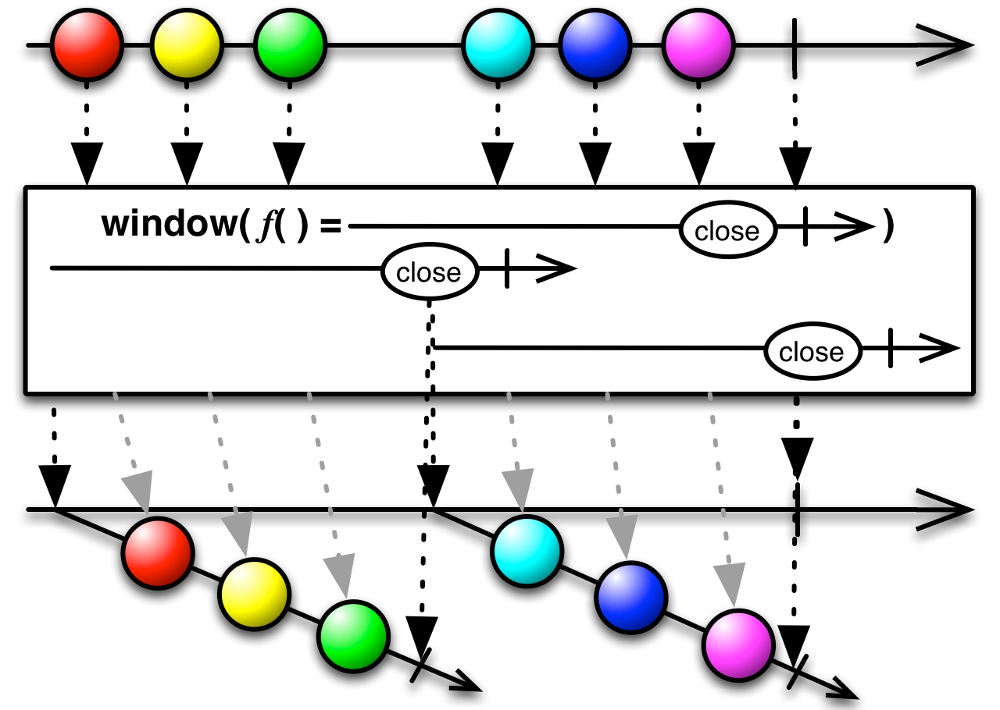
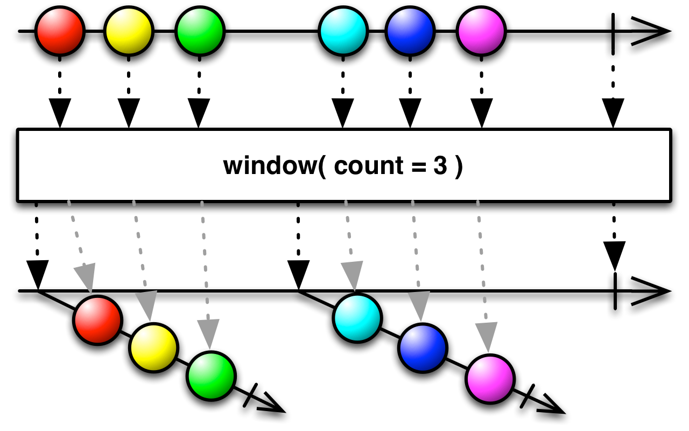
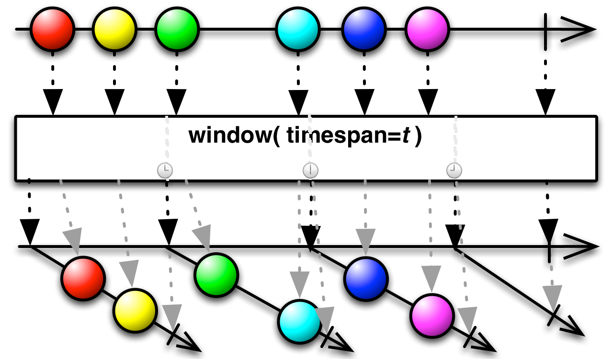

## 19. 并发之意外情况处理

Rx 尽量避免状态泄露到数据流之外的场景。但是有些东西本身就带有状态。比如服务器可以上线和离线、手机可以访问Wifi、按钮被按下了等。在 Rx 中国，我们在一段时间内看到这些事件，并称之为窗口（window）。其他事件在这个窗口内发生可能需要特殊处理。例如，手机在使用移动收费上网的时候，会把网络请求优先级降低，来避免天价流量费的情况。

> 注意：上面的一段话估计是翻译的，有点语句不通。更多参考[官网](http://www.introtorx.com/Content/v1.0.10621.0/17_SequencesOfCoincidence.html#SequencesOfCoincidence)

### 窗口 Window

buffer 函数可以缓存多个数据并整体发射。 window 操作函数和 buffer 有一对一的关系。区别在于 window 不会整体返回缓存的数据。而是把缓存的数据当做一个新的 Observable 数据流来返回。这样当源 Observable 有数据发射了，这个数据就立刻发射到 window 返回的 Observable 里面了。

下图可以看到二者的区别：


window ：



如果你还没有了解 buffer， 建议你到前面的章节下去看看 buffer。 buffer 和 window 的函数形式是一样的，功能也非常类似，并且易于理解。 buffer 都可以用 window 来实现其功能：

```java
source.buffer(...)
// 和下面的是一样的功能
source.window(...).flatMap(w -> w.toList())
```

### Window by count

窗口内可以限定数目。当窗口发射的数据达到了限定的数目，当前窗口的 Observable 就结束并开启一个新的窗口。



和buffer 一样， 使用 window(int count, int skip) 也可以跳过数据或者重叠使用数据。

```java
Observable
    .merge(
        Observable.range(0, 5)
            .window(3,1))
    .subscribe(System.out::println);
```

结果：

```
0
1
1
2
2
2
3
3
3
4
4
4
```

可以看到当有数据重叠的时候， 多个 Observable 会返回同样的数据，可以把结果输出形式修改一下，方便查看：

```java
Observable.range(0, 5)
    .window(3, 1)
    .flatMap(o -> o.toList())
    .subscribe(System.out::println);
```

结果：

```
[0, 1, 2]
[1, 2, 3]
[2, 3, 4]
[3, 4]
[4]
```

这样就可以看到 window 和 buffer 是非常类似的了。

### Window by time

同样也可以指定窗口的时间长度：



```java
public final Observable<Observable<T>> window(long timespan, long timeshift, java.util.concurrent.TimeUnit unit)
```

```java
Observable.interval(100, TimeUnit.MILLISECONDS)
    .take(5)
    .window(250, 100, TimeUnit.MILLISECONDS)
    .flatMap(o -> o.toList())
    .subscribe(System.out::println);
```

结果：

```
[0, 1]
[0, 1, 2]
[1, 2, 3]
[2, 3, 4]
[3, 4]
[4]
```

上面的示例中，每隔100ms开始一个新的窗口，每个窗口持续 250ms。 第一个窗口从 0ms 开始并捕获到数据 [0, 1]（0 是在第100ms的时候发射的）。

### Window with signal

同样也可以用另外一个信号 Observable 当做窗口结束的信号。


信号 Observable 直接也可以相互传递事件。


下面是使用信号 Observable 实现的重叠窗口：

```java
Observable.interval(100, TimeUnit.MILLISECONDS)
    .take(5)
    .window(
        Observable.interval(100, TimeUnit.MILLISECONDS),
        o -> Observable.timer(250, TimeUnit.MILLISECONDS))
    .flatMap(o -> o.toList())
    .subscribe(System.out::println);
```

结果：

```
[1, 2]
[2, 3]
[3, 4]
[4]
[]
```

注意上面的数字 0 没有捕获到，原因在于源 Observable 和 信号 Observable 都是在同一时刻发生的，但是在实际操作中并没有这种情况。所以当信号 Observable发射的时候， 数字 0 已经发射出去了。

### Join

join 可以把两个数据流中的数据组合一起。 zip 函数根据数据发射的顺序来组合数据。 join 可以根据时间来组合。

```java
public final <TRight,TLeftDuration,TRightDuration,R> Observable<R> join(
    Observable<TRight> right,
    Func1<T,Observable<TLeftDuration>> leftDurationSelector,
    Func1<TRight,Observable<TRightDuration>> rightDurationSelector,
    Func2<T,TRight,R> resultSelector)
```

join 组合的两个 Observable 被称之为 左和右。 上面的函数并不是静态的，调用该函数的 Observable就是 左 。参数中的 leftDurationSelector 和 rightDurationSelector 分别使用 左右发射的数据为参数，然后返回一个定义时间间隔的 Observable，和 window 的最后一个重载函数类似。这个时间间隔是用来选择里面发射的数据并组合一起。里面的数据会当做参数调用 resultSelector ，然后返回一个组合后的数据。然后组合后的数据由 join 返回的 Observable 发射出去。

join 比较难以理解以及强大之处就是如果选择组合的数据。当有数据在 源 Observable 中发射，就开始一个该数据的时间窗口。对应的时间间隔用来计时该数据的窗口何时结束。在时间窗口还没结束的时候，另外一个 Observable 发射的数据就和当前的数据组合一起。左右数据流的处理方式是一样的，所以为了简化介绍，我们假定只有一个 源 Observable 有时间窗口。

下面的示例中， 左Observable 数据流从来不结束而右Observable的时间窗口为 0.

```java
Observable<String> left =
        Observable.interval(100, TimeUnit.MILLISECONDS)
            .map(i -> "L" + i);
Observable<String> right =
        Observable.interval(200, TimeUnit.MILLISECONDS)
            .map(i -> "R" + i);

left
    .join(
        right,
        i -> Observable.never(),
        i -> Observable.timer(0, TimeUnit.MILLISECONDS),
        (l,r) -> l + " - " + r
    )
    .take(10)
    .subscribe(System.out::println);
```

结果：

```
L0 - R0
L1 - R0
L0 - R1
L1 - R1
L2 - R1
L3 - R1
L0 - R2
L1 - R2
L2 - R2
L3 - R2
```

由于左边的 Observable 时间窗口是永久，这意味着左边每个发射的数据都会和右边的 数据组合。 当右边数据发射的比左边的慢一倍。所以当左边的数据发射了两个对应右边的同一个数据。然后右边发射下一个数据就开启了右边的一个新的时间窗口，然后左右的数据会从开始的数据和右边的新窗口中的数据组合。

下面示例把左右源 Observable 发射的间隔都设置为 100ms，然后把左时间窗口设置为 150ms：

```java
Observable<String> left =
        Observable.interval(100, TimeUnit.MILLISECONDS)
            .map(i -> "L" + i);
Observable<String> right =
        Observable.interval(100, TimeUnit.MILLISECONDS)
            .map(i -> "R" + i);

left
    .join(
        right,
        i -> Observable.timer(150, TimeUnit.MILLISECONDS),
        i -> Observable.timer(0, TimeUnit.MILLISECONDS),
        (l,r) -> l + " - " + r
    )
    .take(10)
    .subscribe(System.out::println);
```

结果：

```
L0 - R0
L0 - R1
L1 - R1
L1 - R2
L2 - R2
L2 - R3
L3 - R3
L3 - R4
L4 - R4
L4 - R5
```

左右同时发射数据，所以左右同时开始第一个时间窗口，然后组合的数据为 “L0 – R0”。然后 左边的时间窗口继续，而右边发射新的数据 R1 则右边的数据R1和左边的 L0 组合 “L0 – R1”，然后过了 50ms 后， 左边的时间窗口结束了，开启下一个时间窗口，结果为 “L1 – R1”。 一直重复下去。

两个数据流都有时间窗口。每个数据流中的每个值按照如下方式组合：

- 如果旧的数据时间窗口还没有结束，则和另外一个数据流中的每个旧的数据组合
- 如果当前数据的时间窗口还没有结束，则和另外一个数据流中的每个新的数据组合。

### groupJoin

只要检测到一个组合数据，join 就用两个数据调用 resultSelector 并发射返回的数据。 而 groupJoin 又有不同的功能：

```java
public final <T2,D1,D2,R> Observable<R> groupJoin(
    Observable<T2> right,
    Func1<? super T,? extends Observable<D1>> leftDuration,
    Func1<? super T2,? extends Observable<D2>> rightDuration,
    Func2<? super T,? super Observable<T2>,? extends R> resultSelector)
```

除了 resultSelector 以外，其他参数和 join 函数的参数是一样的。这个 resultSelector 从左边的数据流中获取一个数据并从右边数据流中获取一个 Observable。这个 Observable 会发射和左边数据配对的所有数据。groupJoin 中的配对和 join 一样是对称的，但是结果是不一样的。可以把 resultSelect 实现为一个 GroupedObservable， 左边的数据当做 key，而把右边的数据发射出去。

还使用第一个 join的示例，左边的数据流的时间窗口重来不关闭：

```java
Observable<String> left =
        Observable.interval(100, TimeUnit.MILLISECONDS)
            .map(i -> "L" + i)
            .take(6);
Observable<String> right =
        Observable.interval(200, TimeUnit.MILLISECONDS)
            .map(i -> "R" + i)
            .take(3);

left
    .groupJoin(
        right,
        i -> Observable.never(),
        i -> Observable.timer(0, TimeUnit.MILLISECONDS),
        (l, rs) -> rs.toList().subscribe(list -> System.out.println(l + ": " + list))
    )
    .subscribe();
```

结果：

```
L0: [R0, R1, R2]
L1: [R0, R1, R2]
L2: [R1, R2]
L3: [R1, R2]
L4: [R2]
L5: [R2]
```

上面的 示例和 jion 中的示例数据配对是一样的，只是 resultSelector 不一样导致输出的结果不一样。

使用 groupJoin 和 flatMap 可以实现 jion的 功能：

```java
.join(
    right,
    leftDuration
    rightDuration,
    (l,r) -> joinResultSelector(l,r)
)
// 和下面的一样
.groupJoin(
    right,
    leftDuration
    rightDuration,
    (l, rs) -> rs.map(r -> joinResultSelector(l,r))
)
.flatMap(i -> i)
```

通过 join 和 groupBy 也可以实现 groupJoin。在示例代码中有这个实现，感兴趣的可以去看看。
