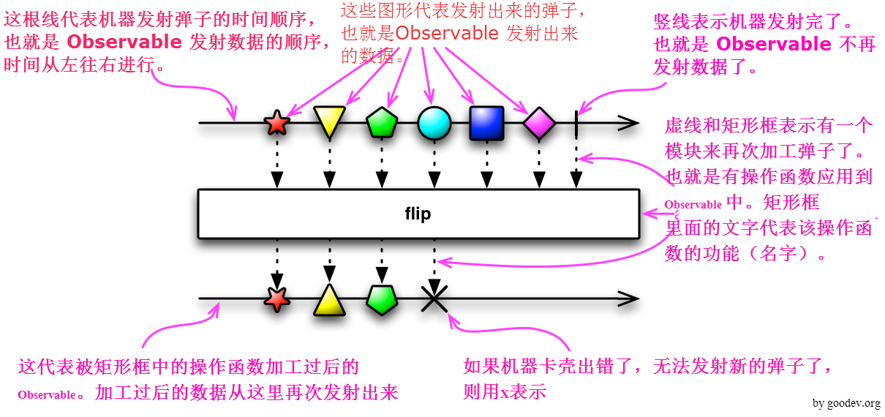
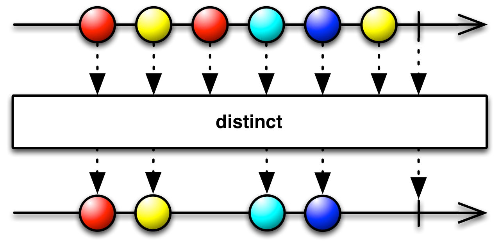
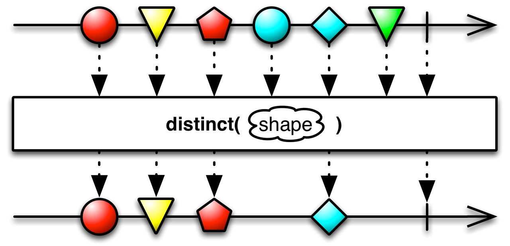
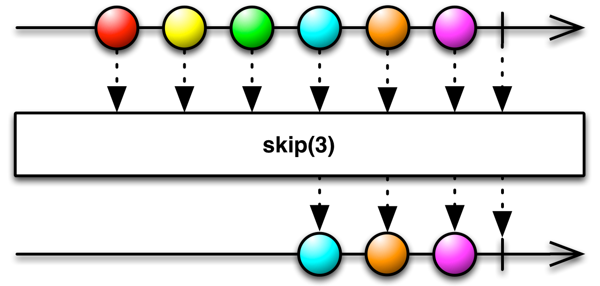

现在你可以用 Rx 来处理大批量实时数据，但是如果把所有大批量数据整个打包发给你的话，使用 Rx 还有啥优势呢？ 本节 我们将介绍一些操作函数（operators ）来过滤数据、或者把所有数据变成一个需要的数据。

如果你了解过函数式编程（functional programming）或者 Java 中的 Stream，则本节介绍的操作函数是非常眼熟的。本节中所有的操作符都返回一个不影响前一个 Observable 的新 Observable。 整个 Rx 框架都遵守该原则。通过创建新的 Observable 来转换之前的 Observable而不会对之前的 Observable 造成干扰。订阅到初始 Observable 的 Subscribers 不会受到任何影响，但是在后面的章节中也会看到，开发者也需要当心该原则。
Marble diagrams（弹子图）

你可以想象一个机器，不停的发射弹子出来，发射出来的弹子可以被其他模块再次加工（比如 上色、把不合格的弹子给回收了），加工完成后再次发射出来 … 弹子图就是对这个机器的抽象描述。在 Rx 中流行使用这种方式来描述操作符，毕竟图片看起来直观多了。 Marble diagrams（弹子图）基本元素如下：



时间从左往右流动，每个图形代表一个数据，竖线代表发射完成了，而 X 代表出现错误了。 操作函数把上面的 Observable 转换下面的新的 Observable ， 里面的每个数据都被操作函数给处理了并返回一个新的数据。

### Filter（过滤数据）

filter 函数使用一个 predicate 函数接口来判断每个发射的值是否能通过这个判断。如果返回 true，则该数据继续往下一个（过滤后的） Observable 发射。


比如下面示例创建了一个发射 0 到 9 十个数字的 源Observable。在该 Observable 使用一个 filter 操作来过滤掉奇数，最后只保留偶数。

```java
Observable<Integer> values = Observable.range(0,10);
Subscription oddNumbers = values
    .filter(v -> v % 2 == 0)
    .subscribe(
        v -> System.out.println(v),
        e -> System.out.println("Error: " + e),
        () -> System.out.println("Completed")
    );

```

输出结果如下：

```
0
2
4
6
8
Completed
```

### distinct 和 distinctUntilChanged

distinct 函数用来过滤掉已经出现过的数据了。



```java
Observable<Integer> values = Observable.create(o -> {
    o.onNext(1);
    o.onNext(1);
    o.onNext(2);
    o.onNext(3);
    o.onNext(2);
    o.onCompleted();
});

Subscription subscription = values
    .distinct()
    .subscribe(
        v -> System.out.println(v),
        e -> System.out.println("Error: " + e),
        () -> System.out.println("Completed")
    );

```

输出结果如下：

```
1
2
3
Completed

```

distinct 还有一个重载函数，该函数有个生成 key 的参数。每个发射的数据都使用该参数生成一个 key，然后使用该key 来判断数据是否一样。

```java
public final <U> Observable<T> distinct(Func1<? super T,? extends U> keySelector)
```



下面示例中使用字符串的第一个字母作为 key 来比较。

```java
Observable<String> values = Observable.create(o -> {
    o.onNext("First");
    o.onNext("Second");
    o.onNext("Third");
    o.onNext("Fourth");
    o.onNext("Fifth");
    o.onCompleted();
});

Subscription subscription = values
    .distinct(v -> v.charAt(0))
    .subscribe(
        v -> System.out.println(v),
        e -> System.out.println("Error: " + e),
        () -> System.out.println("Completed")
    );

```

输出结果：

```
First
Second
Third
Completed

```

“Fourth” 和 “Fifth” 字符串被过滤掉了，应为他们的 key （首字母）和 First 一样。已经发射过的数据将被过滤掉。

有经验的码农知道，该函数在内部维护一个 key 集合来保存所有已经发射数据的 key，当有新的数据发射的时候，在集合中查找该 数据的key 是否存在。 在使用 Rx 操作函数的时把内部细节给封装起来了，但是我们应该注意该问题来避免性能问题。（如果有大量的数据，维护一个内部的集合来保存 key 可能会占用很多内存。）

distinct 还有个变体是 distinctUntilChanged。区别是 distinctUntilChanged 只过滤相邻的 key 一样的数据。

```java
public final Observable<T> distinctUntilChanged()
public final <U> Observable<T> distinctUntilChanged(Func1<? super T,? extends U> keySelector)

```


```java
Observable<Integer> values = Observable.create(o -> {
    o.onNext(1);
    o.onNext(1);
    o.onNext(2);
    o.onNext(3);
    o.onNext(2);
    o.onCompleted();
});

Subscription subscription = values
    .distinctUntilChanged()
    .subscribe(
        v -> System.out.println(v),
        e -> System.out.println("Error: " + e),
        () -> System.out.println("Completed")
    );

```

输出结果如下：

```
1
2
3
2
Completed
```

同样 distinctUntilChanged 也可以使用一个生成 key 的参数：

```
Observable<String> values = Observable.create(o -> {
    o.onNext("First");
    o.onNext("Second");
    o.onNext("Third");
    o.onNext("Fourth");
    o.onNext("Fifth");
    o.onCompleted();
});

Subscription subscription = values
    .distinctUntilChanged(v -> v.charAt(0))
    .subscribe(
            v -> System.out.println(v),
            e -> System.out.println("Error: " + e),
            () -> System.out.println("Completed")
        );
```

输出结果：

```
First
Second
Third
Fourth
Completed

```

### ignoreElements

ignoreElements 会忽略所有发射的数据，只让 onCompleted 和 onError 可以通过。

```
Observable<Integer> values = Observable.range(0, 10);

Subscription subscription = values
    .ignoreElements()
    .subscribe(
        v -> System.out.println(v),
        e -> System.out.println("Error: " + e),
        () -> System.out.println("Completed")
    );

```

输出结果如下：

```
Completed
```

ignoreElements() 和使用 filter(v -> false) 是一样的效果。

## skip 和 take

下面两个操作函数依据发射数据的索引来在特定的位置切断数据流，可以从头开始切断也可以从末尾开始切断。 take 从头开始获取前 N 个数据，而 skip 则是从头开始 跳过 N 个数据。注意，如果发射的数据比 N 小，则这两个函数都会发射一个 error。

```
Observable<T>   take(int num)

```


```
Observable<Integer> values = Observable.range(0, 5);

Subscription first2 = values
    .take(2)
    .subscribe(
        v -> System.out.println(v),
        e -> System.out.println("Error: " + e),
        () -> System.out.println("Completed")
    );

```

输出结果如下：

```
0
1
Completed
```

熟悉 Java 8 Stream 的同学知道 take 函数和 limit 类似。 limit 函数在 Rx 中也有，和 take 是一样的。只是为了方便熟悉 limit 的同学使用而已。

只要第 N 个数据可用， take 操作就结束了。 如果在 N 个数据发射之前发生了 error， error 信息会继续传递到下一个 Observable。 如果 第 N 个数据发射后， take 就不再关心源 Observable 的状态了。

```
Observable<Integer> values = Observable.create(o -> {
    o.onNext(1);
    o.onError(new Exception("Oops"));
});

Subscription subscription = values
    .take(1)
    .subscribe(
        v -> System.out.println(v),
        e -> System.out.println("Error: " + e),
        () -> System.out.println("Completed")
    );

```

输出结果如下：

```
1
Completed

```

skip 返回 take 操作忽略的另外一部分数据。也就是跳过前面 N 个数据。

```
Observable<T>   skip(int num)
```



```
Observable<Integer> values = Observable.range(0, 5);

Subscription subscription = values
    .skip(2)
    .subscribe(
        v -> System.out.println(v),
        e -> System.out.println("Error: " + e),
        () -> System.out.println("Completed")
    );

```

输出结果如下：

```
2
3
4
Completed

```

除了根据发射数据的索引来过滤数据以外，还可以使用数据流发射的时间来过滤。比如过滤掉前五秒发射的数据。

```
Observable<T>   take(long time, java.util.concurrent.TimeUnit unit)
Observable<T>   skip(long time, java.util.concurrent.TimeUnit unit)

```

```
Observable<Long> values = Observable.interval(100, TimeUnit.MILLISECONDS);

Subscription subscription = values
    .take(250, TimeUnit.MILLISECONDS)
    .subscribe(
        v -> System.out.println(v),
        e -> System.out.println("Error: " + e),
        () -> System.out.println("Completed")
    );

```

输出结果如下：

```
0
1
Completed
```

上面示例中只获取前 250 毫秒发射的数据。 第 300 毫秒才开始发射数据 3， 所以这里只获取 0 和1 两个数据。

### skipWhile 和 takeWhile

这两个函数是使用一个 predicate 参数来当做判断条件。 如果判断条件返回为 ture， 则 takeWhile 保留该数据。

```
Observable<T>   takeWhile(Func1<? super T,java.lang.Boolean> predicate)1
```

```
Observable<Long> values = Observable.interval(100, TimeUnit.MILLISECONDS);

Subscription subscription = values
    .takeWhile(v -> v < 2)
    .subscribe(
        v -> System.out.println(v),
        e -> System.out.println("Error: " + e),
        () -> System.out.println("Completed")
    );

```

输出结果如下：

```
0
1
Completed
```

不出意料， skipWhile 跳过过滤条件为 true 的数据。

```
Observable<Long> values = Observable.interval(100, TimeUnit.MILLISECONDS);

Subscription subscription = values
    .skipWhile(v -> v < 2)
    .subscribe(
        v -> System.out.println(v),
        e -> System.out.println("Error: " + e),
        () -> System.out.println("Completed")
    );

```

输出结果：

```
2
3
4
...
```

### skipLast 和 takeLast

skip 和 take 是从头开始索引数据，而 skipLast 和 takeLast 和他们相反，是从末尾开始索引数据。

```
Observable<Integer> values = Observable.range(0,5);

Subscription subscription = values
    .skipLast(2)
    .subscribe(
        v -> System.out.println(v),
        e -> System.out.println("Error: " + e),
        () -> System.out.println("Completed")
    );

```

输出结果：

```
0
1
2
Completed
```

同样这两个函数也有依时间为条件的重载函数。

### takeUntil 和 skipUntil

takeUntil 和 skipUntil 这两个函数和 takeWhile 、skipWhile 刚好相反。 当判断条件为 false 的时候， takeUntil 保留该数据。

takeUntil 和 skipUntil 还有另外一种不一样的重载函数。切断的条件为 另外一个 Observable 发射数据的时刻。

```
// 获取源Observable的数据直到 other Observable 发射第一个数据时停止
public final <E> Observable<T> takeUntil(Observable<? extends E> other)

```


```
Observable<Long> values = Observable.interval(100,TimeUnit.MILLISECONDS);
Observable<Long> cutoff = Observable.timer(250, TimeUnit.MILLISECONDS);

Subscription subscription = values
    .takeUntil(cutoff)
    .subscribe(
        v -> System.out.println(v),
        e -> System.out.println("Error: " + e),
        () -> System.out.println("Completed")
    );
```

输出结果：

```
0
1
Completed
```

你应该还记得，这个 timer 函数会等待 250 毫秒然后发射一个数据。当 takeUntil 收到 这个数据的时候就停止继续接受 values 发射的数据。 cutoff 这个充当信号的 Observable 可以是任意数据类型的，这里不关心数据只关心何时发射了数据。

skipUntil 也是一样，当收到另外一个 Observable 发射数据的时候，就开始接收 源 Observable 的数据。

```
Observable<Long> values = Observable.interval(100,TimeUnit.MILLISECONDS);
Observable<Long> cutoff = Observable.timer(250, TimeUnit.MILLISECONDS);

Subscription subscription = values
    .skipUntil(cutoff)
    .subscribe(
        v -> System.out.println(v),
        e -> System.out.println("Error: " + e),
        () -> System.out.println("Completed")
    );
```

输出结果：

```
2
3
4
...
```
